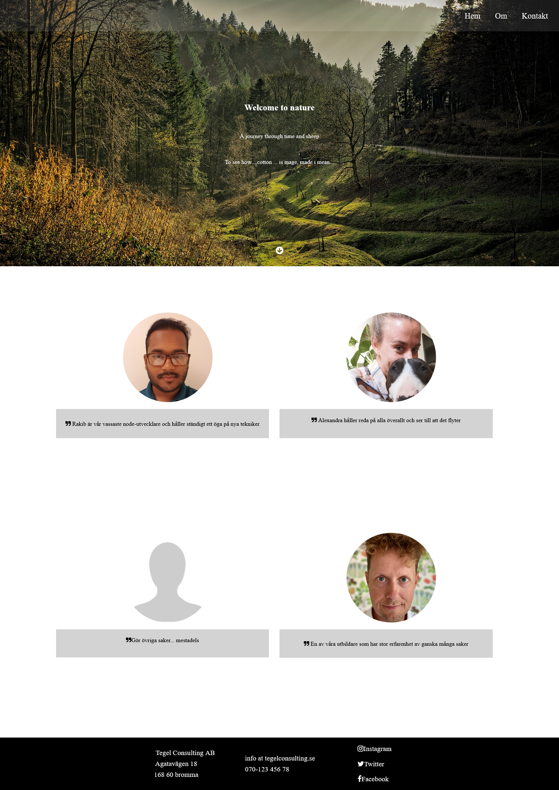

## Table of contents

- [Overview](#overview)
  - [Clone Website](#clone-website)
  - [Project setup](#project-setup)
  - [Built with](#built-with)
  - [Screenshot](#screenshot)
  - [Author](#author)

## Overview

### Clone Website

Welcome to my Clone Website!

This clone website is from Medieinstitutet Stockholm Sweden.
In the folder InfoToAssignment you can find the site i was cloning.

Some of the textual information is in swedish but that dosen't affect the code.

## Project setup

```
npm install
```

### Compiles and hot-reloads for development

```
npm run sass
```

### Built with

- html
- scss/sass
- flex

### Screenshot



### Author

[Github](https://github.com/Rasweb)

[Website](https://rasweb.one/)
